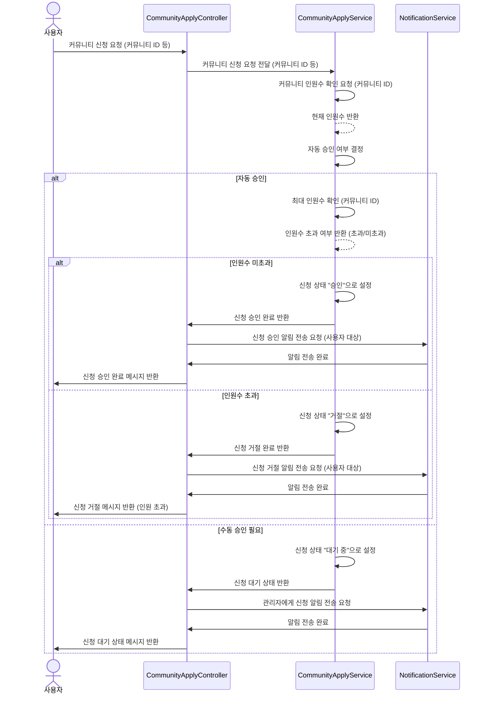
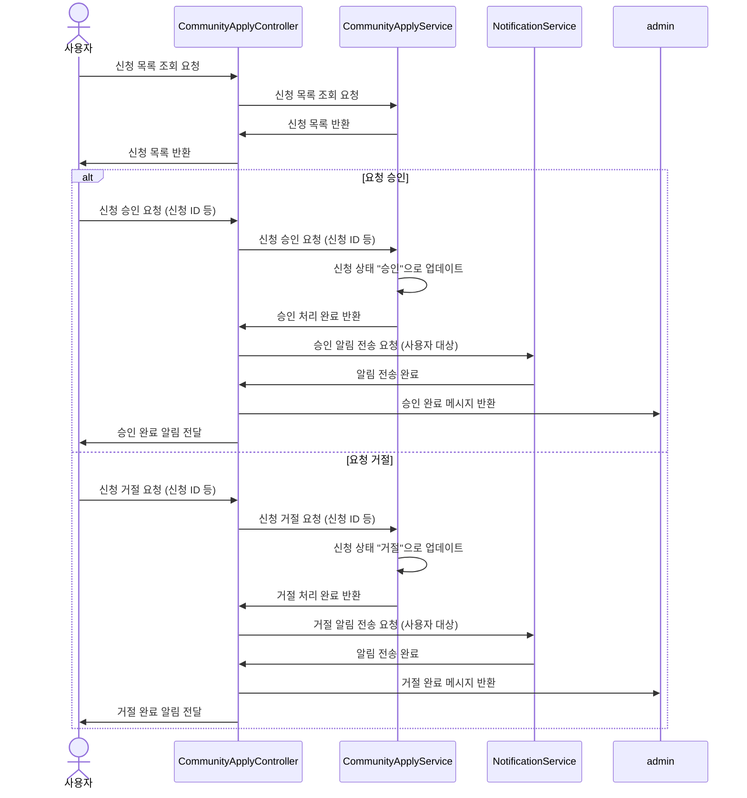
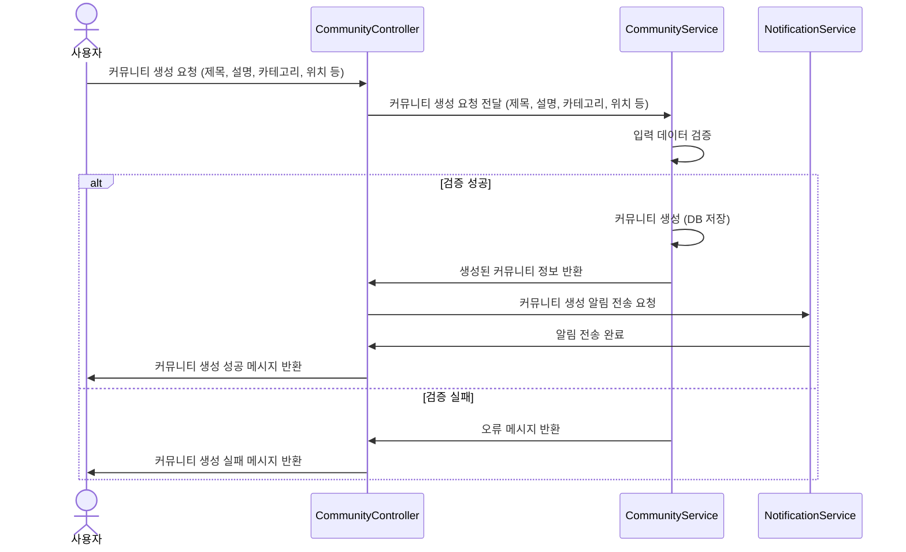
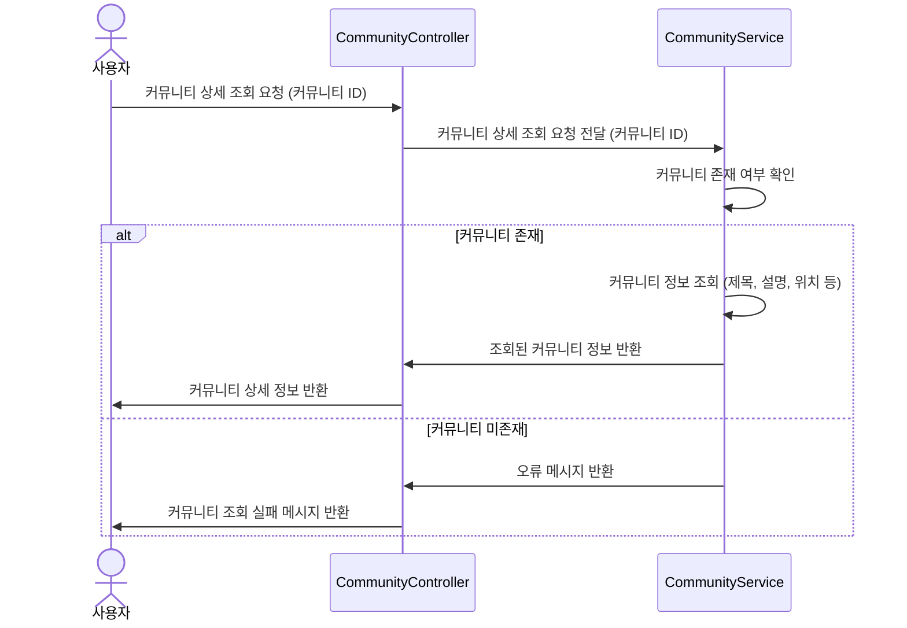
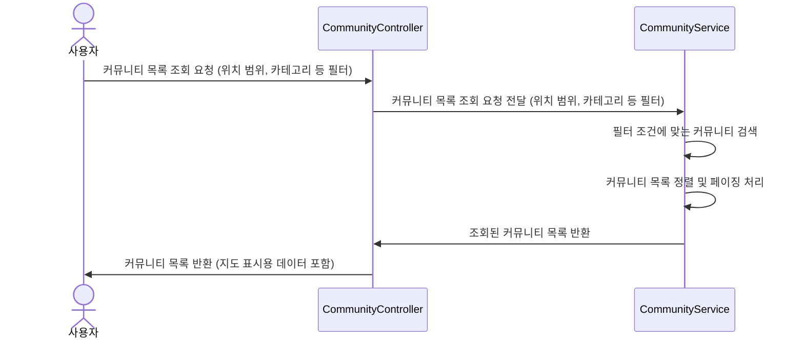
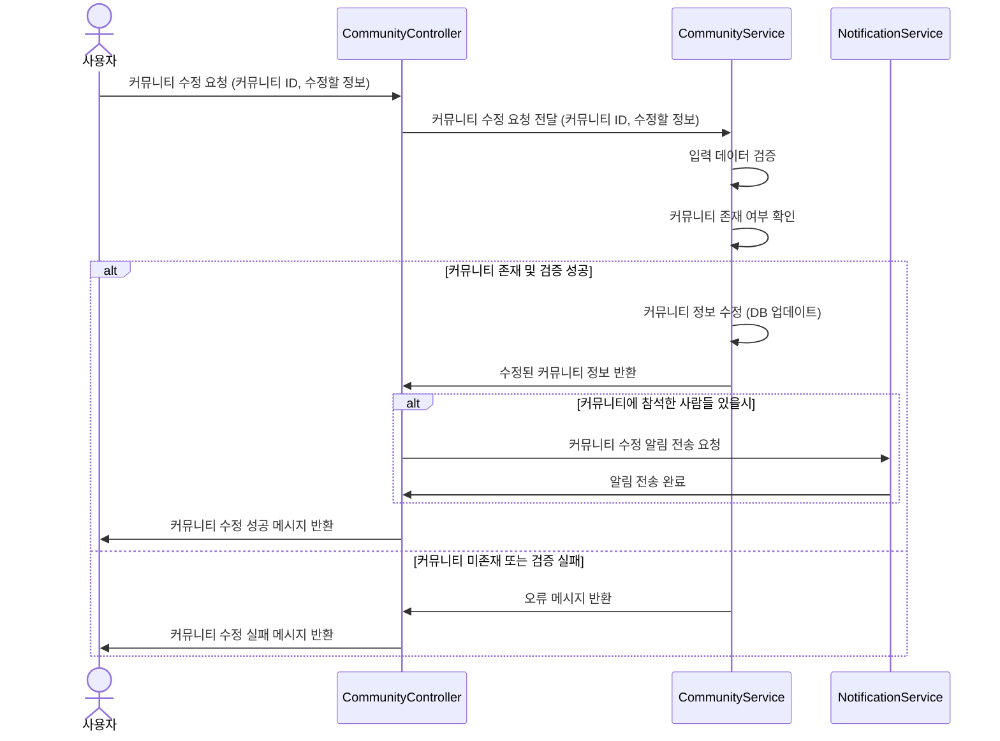
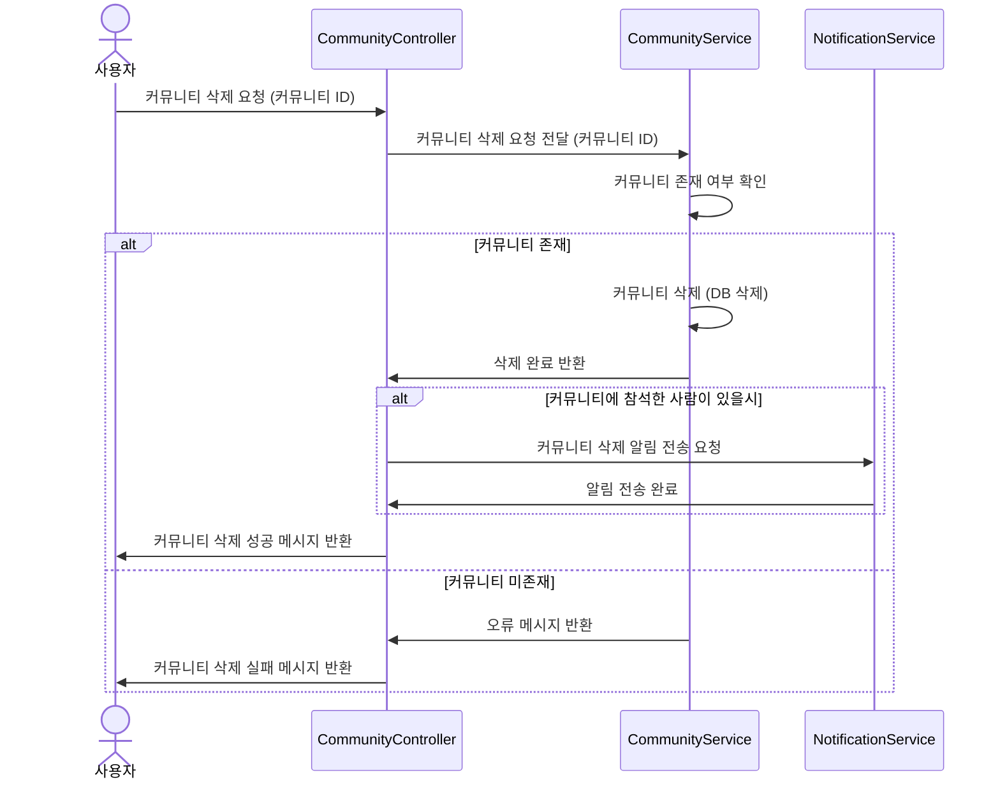
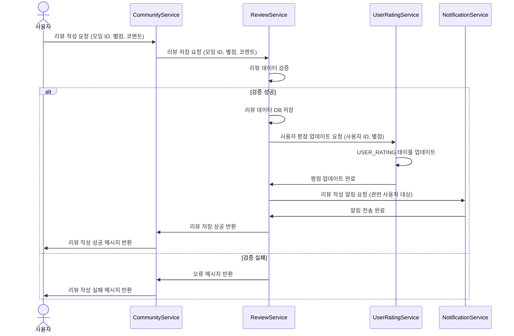

# 커뮤니티 시퀀스 다이어그램 인덱스

1. [커뮤니티 신청](#커뮤니티-신청)
2. [커뮤니티 목록 조회 및 승인, 거절](#커뮤니티-목록-조회-및-승인-거절)
3. [커뮤니티 생성](#커뮤니티-생성)
4. [커뮤니티 상세조회](#커뮤니티-상세조회)
5. [커뮤니티 목록 조회](#커뮤니티-목록-조회)
6. [커뮤니티 수정](#커뮤니티-수정)
7. [커뮤니티 삭제](#커뮤니티-삭제)
8. [커뮤니티 종료 후 리뷰 남기기](#커뮤니티-종료-후-리뷰-남기기)

## 커뮤니티 신청

## 커뮤니티 목록 조회 및 승인, 거절

## 커뮤니티 생성

## 커뮤니티 상세조회

## 커뮤니티 목록 조회

## 커뮤니티 수정

## 커뮤니티 삭제

## 커뮤니티 종료 후 리뷰 남기기

