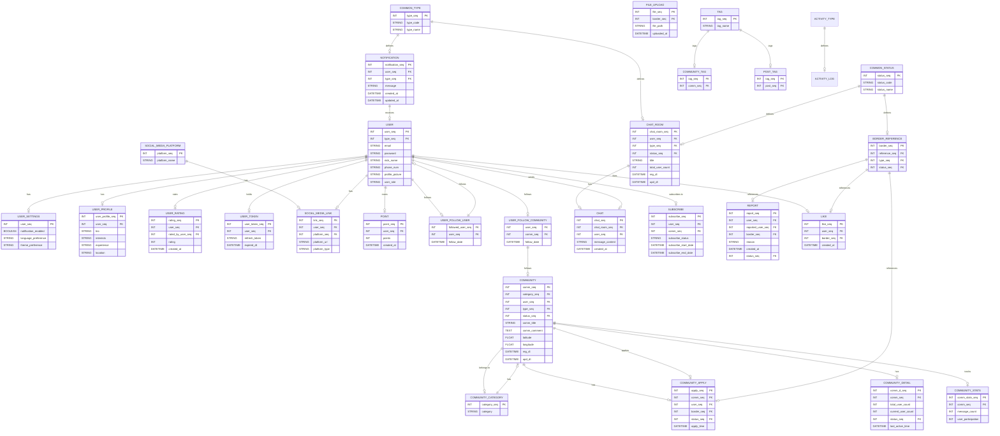

```mermaid
erDiagram
    COMMON_STATUS {
        INT status_seq PK
        STRING status_code
        STRING status_name
    }

    COMMON_TYPE {
        INT type_seq PK
        STRING type_code
        STRING type_name
    }

    FILE_UPLOAD {
        INT file_seq PK
        INT border_seq FK
        STRING file_path
        DATETIME uploaded_at
    }

    USER_SETTINGS {
        INT user_seq PK
        BOOLEAN notification_enabled
        STRING language_preference
        STRING theme_preference
    }

    USER_PROFILE {
        INT user_profile_seq PK
        INT user_seq FK
        STRING bio
        STRING interests
        STRING experience
        STRING location
    }

    USER_RATING {
        INT rating_seq PK
        INT user_seq FK
        INT rated_by_user_seq FK
        INT rating
        DATETIME created_at
    }

    USER_TOKEN {
        INT user_token_seq PK
        INT user_seq FK
        STRING refresh_token
        DATETIME expired_dt
    }

    SOCIAL_MEDIA_PLATFORM {
        INT platform_seq PK
        STRING platform_name
    }

    SOCIAL_MEDIA_LINK {
        INT link_seq PK
        INT user_seq FK
        INT platform_seq FK
        STRING platform_url
        STRING platform_type  
    }

    POINT {
        INT point_seq PK
        INT user_seq FK
        INT points
        DATETIME created_at
    }

    USER {
        INT user_seq PK
        INT type_seq FK
        STRING email
        STRING password
        STRING nick_name
        STRING phone_num
        STRING profile_picture
        STRING user_role
    }

    USER_FOLLOW_USER {
        INT followed_user_seq FK
        INT user_seq FK
        DATETIME follow_date
    }

    USER_FOLLOW_COMMUNITY {
        INT user_seq FK
        INT comm_seq FK
        DATETIME follow_date
    }

    NOTIFICATION {
        INT notification_seq PK
        INT user_seq FK
        INT type_seq FK
        STRING message
        DATETIME created_at
        DATETIME updated_at
    }

    COMMUNITY {
        INT comm_seq PK
        INT category_seq FK
        INT user_seq FK
        INT type_seq FK
        INT status_seq FK
        STRING comm_title
        TEXT comm_comment
        FLOAT latitude
        FLOAT longitude
        DATETIME reg_dt
        DATETIME upd_dt
    }

    COMMUNITY_CATEGORY {
        INT category_seq PK
        STRING category
    }

    COMMUNITY_DETAIL {
        INT comm_d_seq PK
        INT comm_seq FK
        INT total_user_count
        INT current_user_count
        INT status_seq FK
        DATETIME last_active_time
    }

    COMMUNITY_STATS {
        INT comm_stats_seq PK
        INT comm_seq FK
        INT message_count
        INT user_participation
    }

    COMMUNITY_APPLY {
        INT apply_seq PK
        INT comm_seq FK
        INT user_seq FK
        INT border_seq FK
        INT status_seq FK
        DATETIME apply_time
    }

    CHAT_ROOM {
        INT chat_room_seq PK
        INT user_seq FK
        INT type_seq FK
        INT status_seq FK
        STRING title
        INT total_user_count
        DATETIME reg_dt
        DATETIME upd_dt
    }

    CHAT {
        INT chat_seq PK
        INT chat_room_seq FK
        INT user_seq FK
        STRING message_content
        DATETIME created_at
    }

    SUBSCRIBE {
        INT subscribe_seq PK
        INT user_seq FK
        INT comm_seq FK
        STRING subscribe_status
        DATETIME subscribe_start_date
        DATETIME subscribe_end_date
    }

    REPORT {
        INT report_seq PK
        INT user_seq FK
        INT reported_user_seq FK
        INT border_seq FK
        STRING reason
        DATETIME created_at
        INT status_seq FK
    }

    LIKE {
        INT like_seq PK
        INT user_seq FK
        INT border_seq FK
        DATETIME created_at
    }

    BORDER_REFERENCE {
        INT border_seq PK
        INT reference_seq FK
        INT type_seq FK
        INT status_seq FK
    }

    TAG {
        INT tag_seq PK
        STRING tag_name
    }

    COMMUNITY_TAG {
        INT tag_seq FK
        INT comm_seq FK
    }

    POST_TAG {
        INT tag_seq FK
        INT post_seq FK
    }

    COMMUNITY_CATEGORY ||--o| COMMUNITY : "has"
    USER ||--o| USER_SETTINGS : "has"
    USER ||--o| USER_RATING : "rates"
    USER ||--o| USER_PROFILE : "has"
    USER ||--o| USER_TOKEN : "holds"
    USER ||--o| USER_FOLLOW_USER : "follows"
    USER ||--o| USER_FOLLOW_COMMUNITY : "follows"
    COMMUNITY ||--o| COMMUNITY_CATEGORY : "belongs to"
    COMMUNITY ||--o| COMMUNITY_APPLY : "has"
    COMMUNITY ||--o| COMMUNITY_DETAIL : "has"
    COMMUNITY ||--o| COMMUNITY_STATS : "tracks"
    COMMUNITY ||--o| COMMUNITY_APPLY : "applies"
    USER ||--o| SUBSCRIBE : "subscribes to"
    USER ||--o| LIKE : "likes"
    USER ||--o| POINT : "earns"
    NOTIFICATION ||--o| USER : "receives"
    COMMON_TYPE ||--o| NOTIFICATION : "defines"
    BORDER_REFERENCE ||--o| COMMUNITY_APPLY : "references"
    BORDER_REFERENCE ||--o| REPORT : "references"
    BORDER_REFERENCE ||--o| LIKE : "references"
    COMMON_STATUS ||--o| BORDER_REFERENCE : "defines"
    SOCIAL_MEDIA_PLATFORM ||--o| SOCIAL_MEDIA_LINK : "has"
    USER ||--o| SOCIAL_MEDIA_LINK : "has"
    CHAT_ROOM ||--o| CHAT : "has"
    USER ||--o| CHAT : "sends"
    COMMON_TYPE ||--o| CHAT_ROOM : "defines"
    COMMON_STATUS ||--o| CHAT_ROOM : "defines"
    ACTIVITY_TYPE ||--o| ACTIVITY_LOG : "defines"
    TAG ||--o| COMMUNITY_TAG : "tags"
    TAG ||--o| POST_TAG : "tags"
    USER_FOLLOW_COMMUNITY ||--o| COMMUNITY : "follows"
    USER_FOLLOW_USER ||--o| USER : "follows"


```