# 프로젝트 시퀀스 다이어그램 인덱스

1. [회원가입](#회원가입)
2. [로그인](#로그인)
3. [회원정보 수정](#회원정보-수정)
4. [회원 삭제](#회원-삭제)
5. [회원 세팅 수정](#회원-세팅-수정)
6. [회원 프로필 조회](#회원-프로필-조회)
7. [회원 프로필 수정](#회원-프로필-수정)
8. [구독 신청](#구독-신청)
9. [구독 목록 조회](#구독-목록-조회)
10. [구독 수정](#구독-수정)
11. [사용자 랭킹 조회](#사용자-랭킹-조회)
12. [채팅방 생성](#채팅방-생성)
13. [채팅방 참여](#채팅방-참여)
14. [메시지 전송](#메시지-전송)
15. [신고 신청](#신고-신청)
16. [신고 처리](#신고-처리)
---

## 회원가입

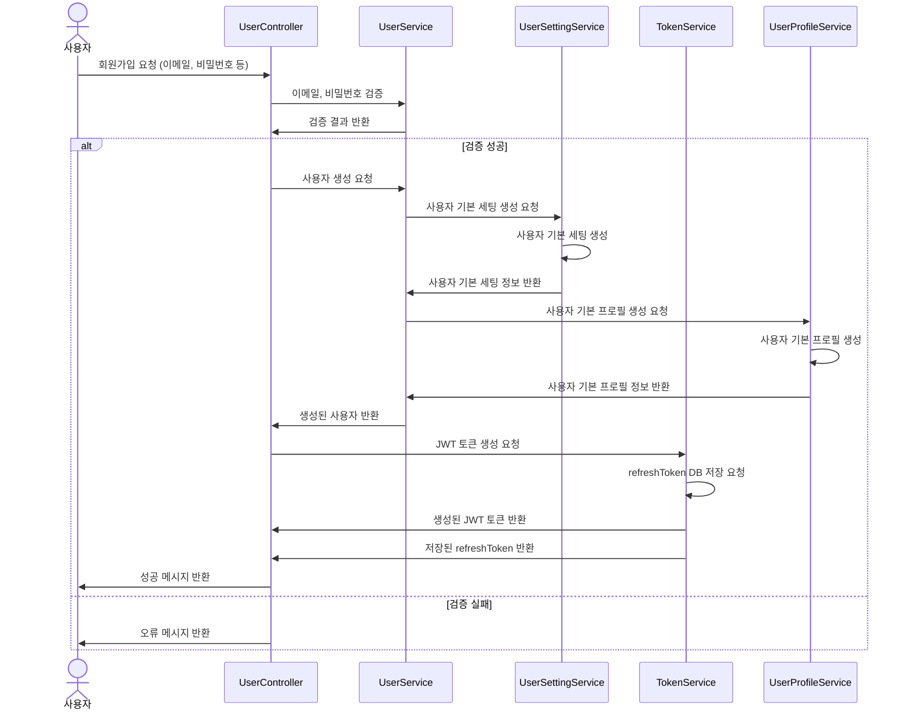

## 로그인
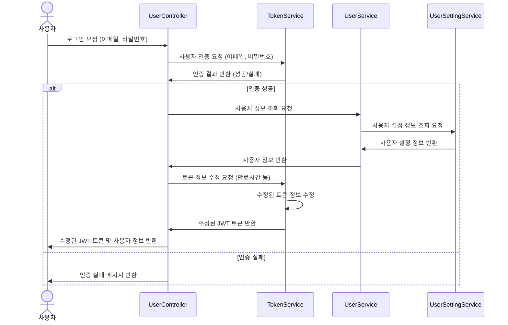

## 회원정보 수정
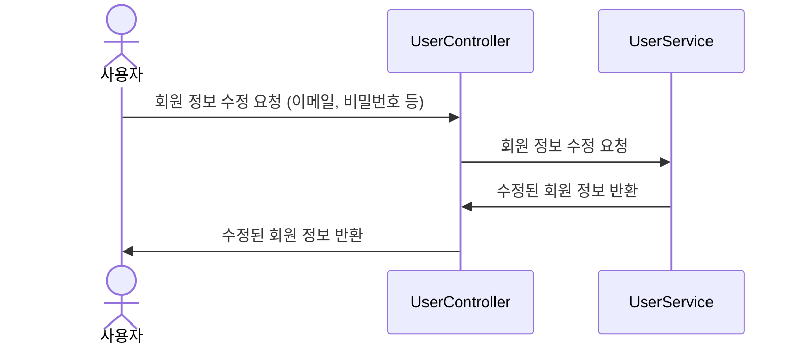

## 회원 삭제
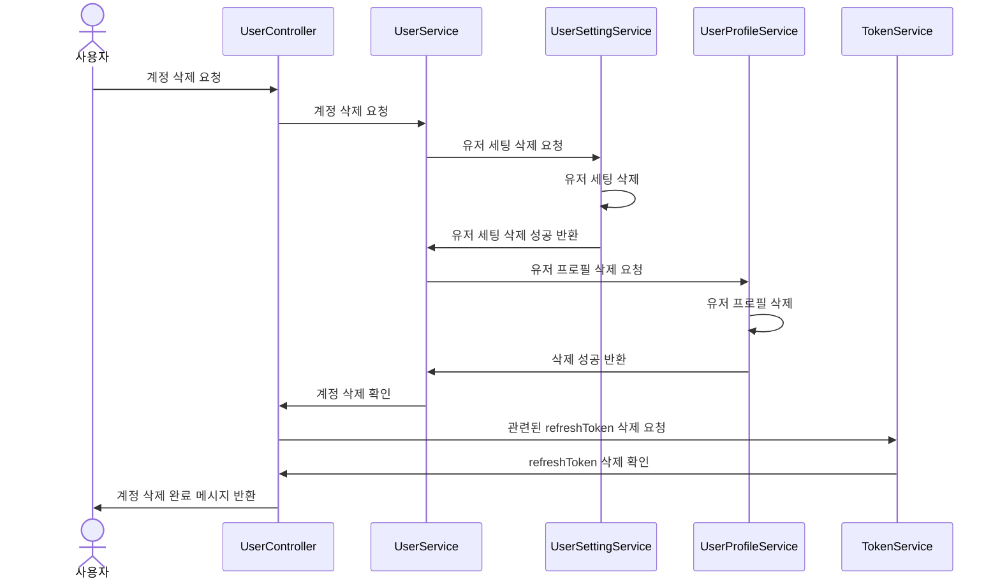
## 회원 세팅 수정
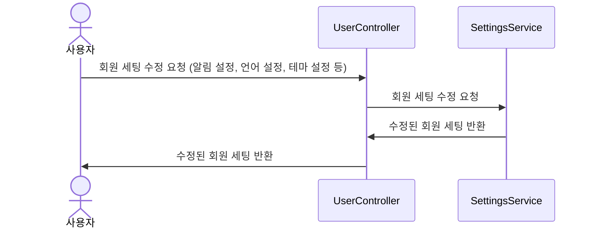

## 회원 프로필 조회
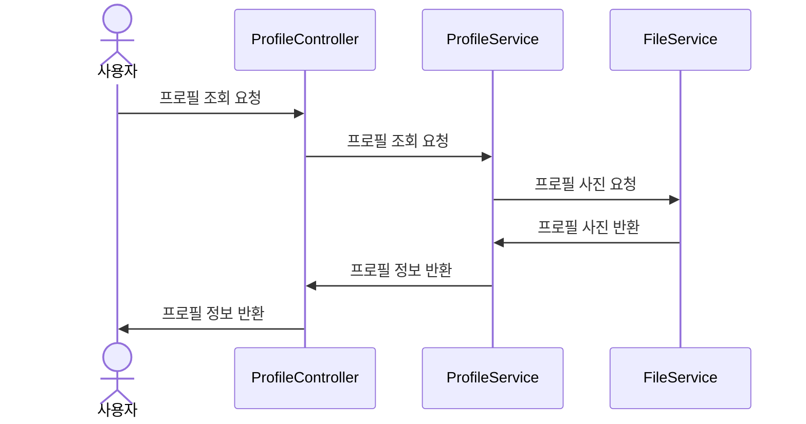

## 회원 프로필 수정

## 구독 신청
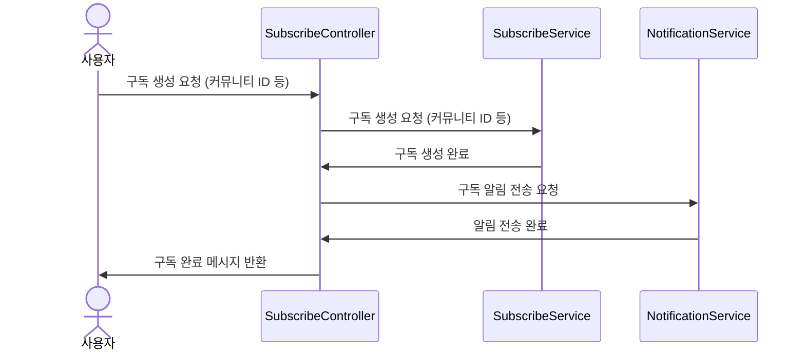

## 구독 목록 조회
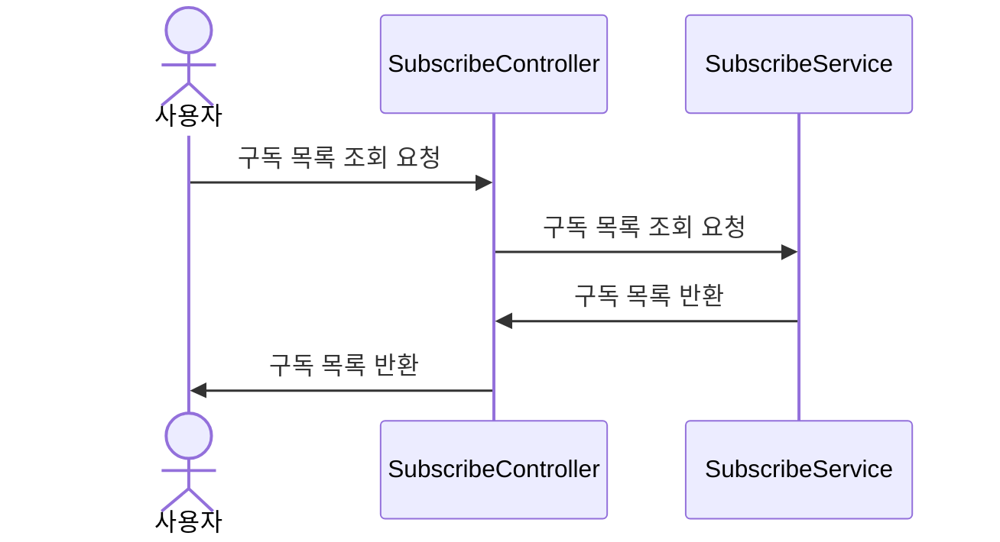

## 구독 수정
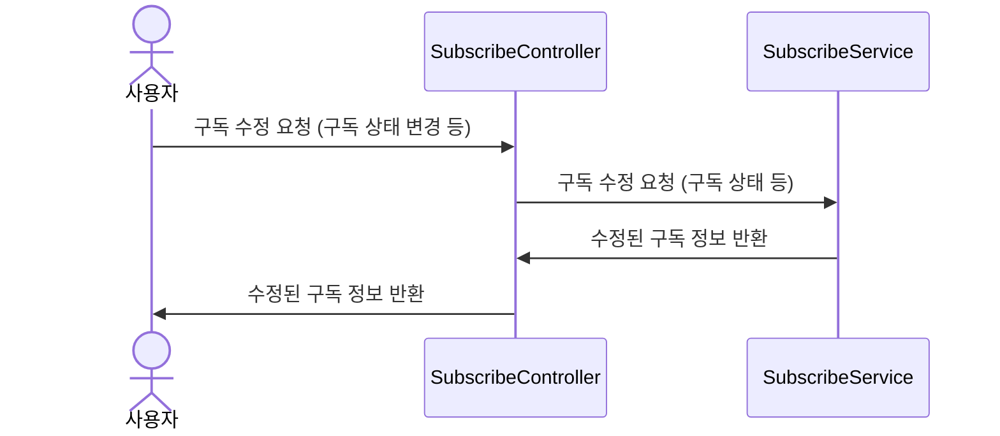

## 사용자 랭킹 조회
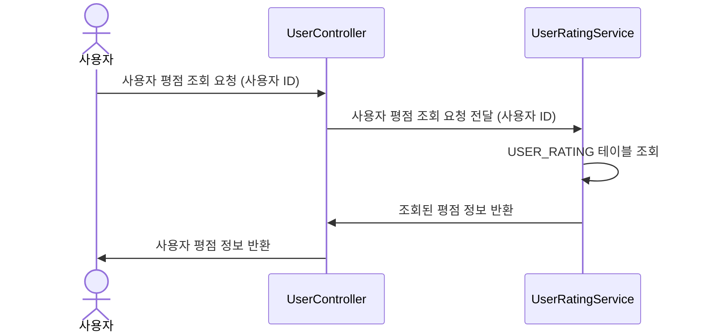

## 채팅방 생성
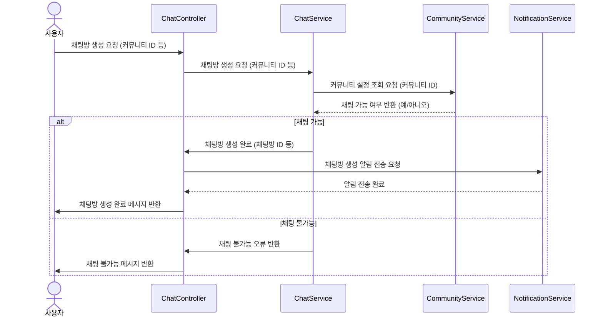
## 채팅방 참여
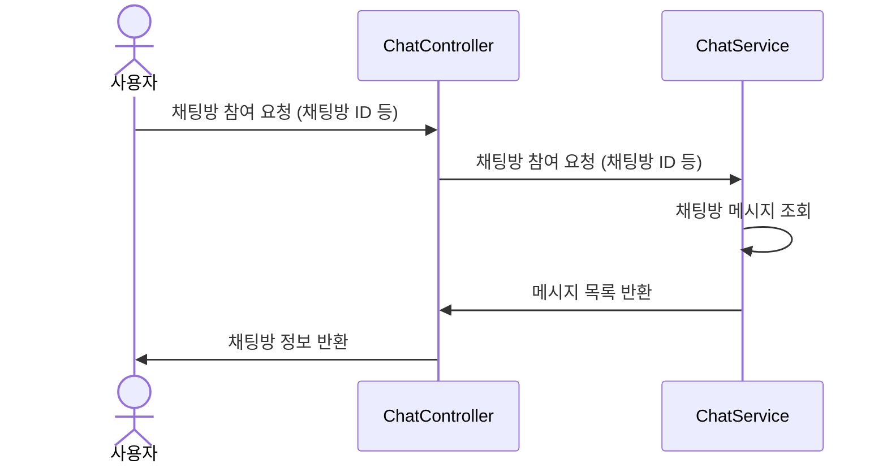

## 메시지 전송
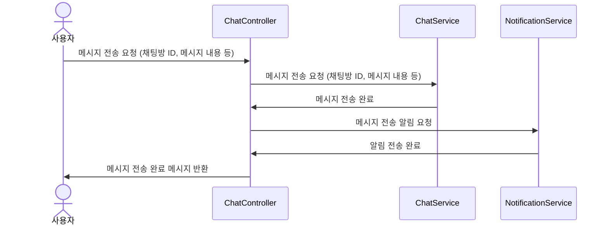

## 신고 신청
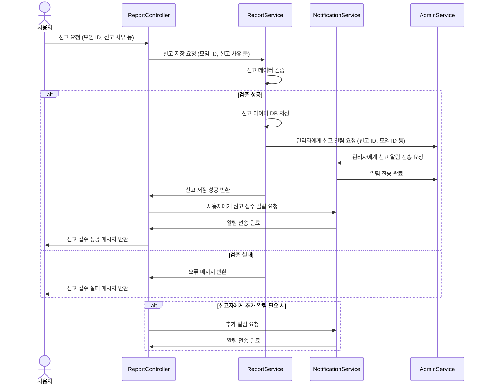

## 신고 처리
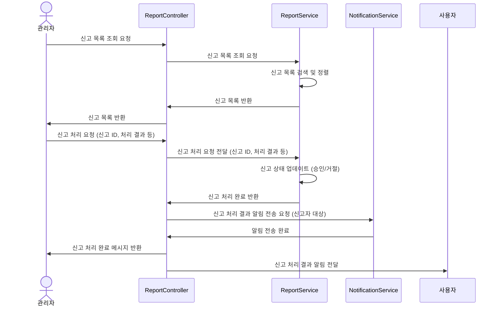