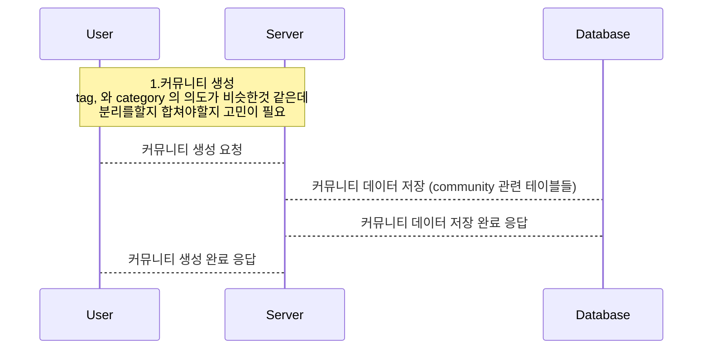
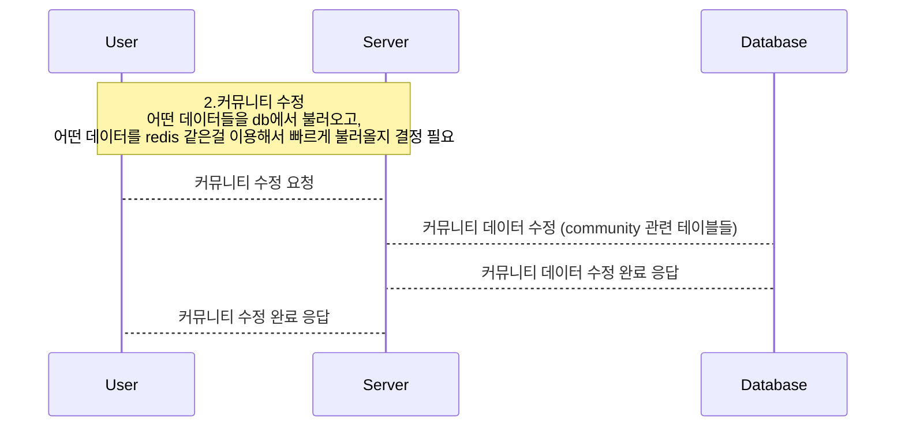
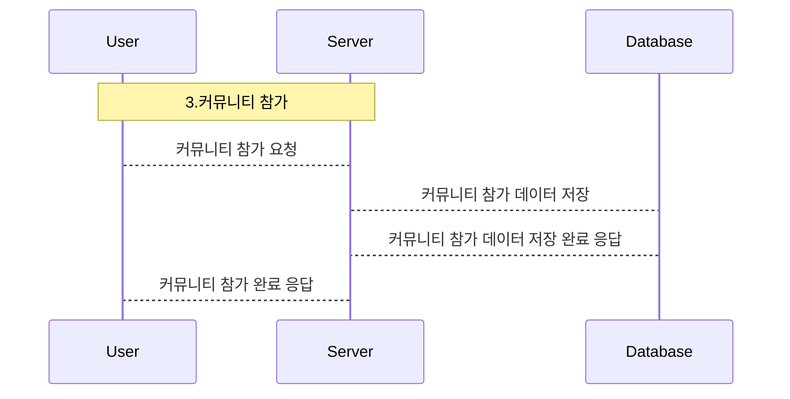
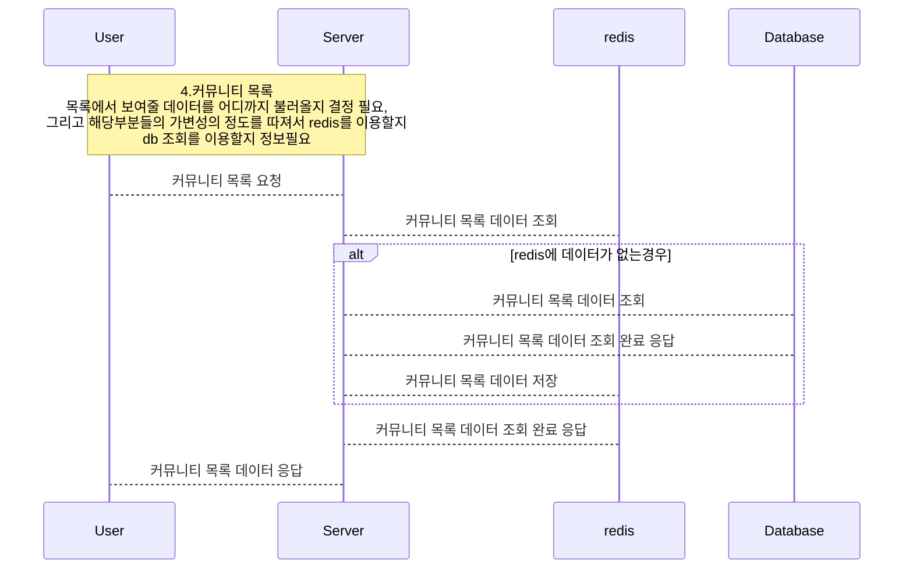

```mermaid
sequenceDiagram
    %% 1. 커뮤니티 생성
    Note over User, Server: 1.커뮤니티 생성<br> tag, 와 category 의 의도가 비슷한것 같은데<br> 분리를할지 합쳐야할지 고민이 필요
    User --> Server: 커뮤니티 생성 요청
    Server --> Database: 커뮤니티 데이터 저장 (community 관련 테이블들)
    Database --> Server: 커뮤니티 데이터 저장 완료 응답
    Server --> User: 커뮤니티 생성 완료 응답
```

```mermaid
sequenceDiagram
    %% 2. 커뮤니티 수정
    Note over User, Server: 2.커뮤니티 수정 <br>어떤 데이터들을 db에서 불러오고, <br>어떤 데이터를 redis 같은걸 이용해서 빠르게 불러올지 결정 필요
    User --> Server: 커뮤니티 수정 요청
    Server --> Database: 커뮤니티 데이터 수정 (community 관련 테이블들)
    Database --> Server: 커뮤니티 데이터 수정 완료 응답
    Server --> User: 커뮤니티 수정 완료 응답
```

```mermaid
sequenceDiagram
    %% 3. 커뮤니티 참가
    Note over User, Server: 3.커뮤니티 참가
    User --> Server: 커뮤니티 참가 요청
    Server --> Database: 커뮤니티 참가 데이터 저장
    Database --> Server: 커뮤니티 참가 데이터 저장 완료 응답
    Server --> User: 커뮤니티 참가 완료 응답
```

```mermaid
sequenceDiagram
    %% 4. 커뮤니티 목록
    Note over User, Server: 4.커뮤니티 목록 <br> 목록에서 보여줄 데이터를 어디까지 불러올지 결정 필요, <br>그리고 해당부분들의 가변성의 정도를 따져서 redis를 이용할지 <br>db 조회를 이용할지 정보필요
    User --> Server: 커뮤니티 목록 요청
    Server --> redis: 커뮤니티 목록 데이터 조회
    alt redis에 데이터가 없는경우
        Server --> Database: 커뮤니티 목록 데이터 조회
        Database --> Server: 커뮤니티 목록 데이터 조회 완료 응답
        Server --> redis: 커뮤니티 목록 데이터 저장
    end 
    redis --> Server: 커뮤니티 목록 데이터 조회 완료 응답
    Server --> User: 커뮤니티 목록 데이터 응답
```