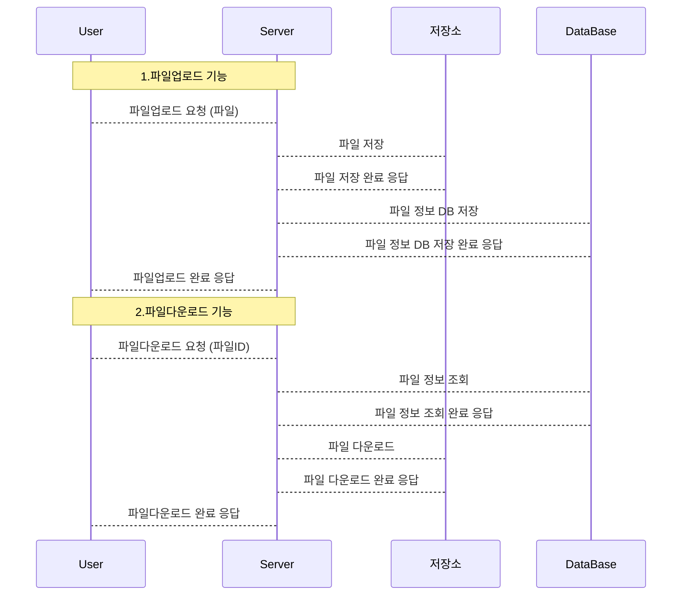
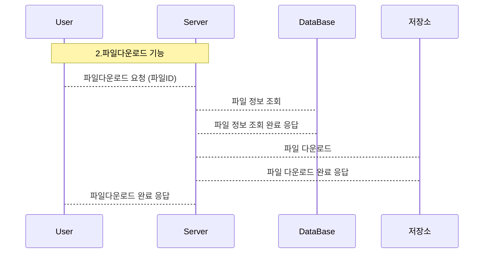
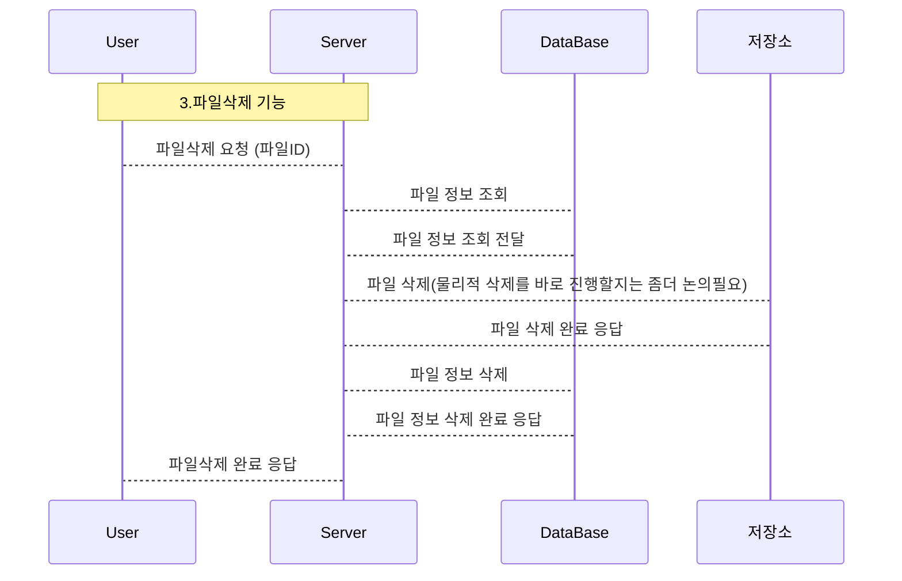

```mermaid
sequenceDiagram
    %% 1. 파일업로드 기능
    Note over User, Server: 1.파일업로드 기능
    User --> Server : 파일업로드 요청 (파일)
    Server --> 저장소 : 파일 저장
    저장소 --> Server : 파일 저장 완료 응답
    Server --> DataBase : 파일 정보 DB 저장
    DataBase --> Server : 파일 정보 DB 저장 완료 응답
    Server --> User : 파일업로드 완료 응답
    
    %% 2. 파일다운로드 기능
    Note over User, Server: 2.파일다운로드 기능
    User --> Server : 파일다운로드 요청 (파일ID)
    Server --> DataBase : 파일 정보 조회
    DataBase --> Server : 파일 정보 조회 완료 응답
    Server --> 저장소 : 파일 다운로드
    저장소 --> Server : 파일 다운로드 완료 응답
    Server --> User : 파일다운로드 완료 응답
```

```mermaid
sequenceDiagram
    %% 2. 파일다운로드 기능
    Note over User, Server: 2.파일다운로드 기능
    User --> Server : 파일다운로드 요청 (파일ID)
    Server --> DataBase : 파일 정보 조회
    DataBase --> Server : 파일 정보 조회 완료 응답
    Server --> 저장소 : 파일 다운로드
    저장소 --> Server : 파일 다운로드 완료 응답
    Server --> User : 파일다운로드 완료 응답
```

```mermaid
sequenceDiagram
%% 3. 파일삭제 기능
    Note over User, Server: 3.파일삭제 기능
    User --> Server : 파일삭제 요청 (파일ID)
    Server --> DataBase : 파일 정보 조회
    DataBase --> Server : 파일 정보 조회 전달
    Server --> 저장소 : 파일 삭제(물리적 삭제를 바로 진행할지는 좀더 논의필요)
    저장소 --> Server : 파일 삭제 완료 응답
    Server --> DataBase : 파일 정보 삭제
    DataBase --> Server : 파일 정보 삭제 완료 응답
    Server --> User : 파일삭제 완료 응답
```