### 일반 사용자 기능 정리

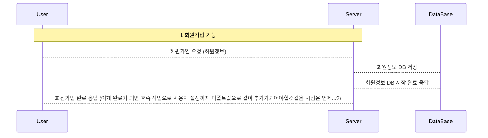
```mermaid
sequenceDiagram
    %% 1. 회원가입 기능
    Note over User, Server: 1.회원가입 기능
    User --> Server : 회원가입 요청 (회원정보)
    Server --> DataBase : 회원정보 DB 저장
    DataBase --> Server : 회원정보 DB 저장 완료 응답
    Server --> User : 회원가입 완료 응답 (이게 완료가 되면 후속 작업으로 사용자 설정까지 디폴트값으로 같이 추가가되어야할것같음 시점은 언제...?)
```

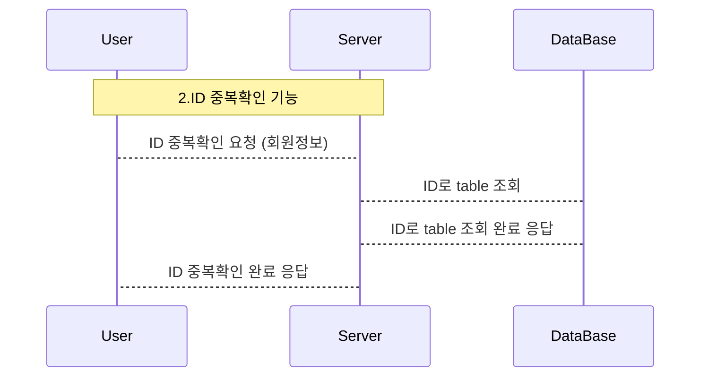
```mermaid
sequenceDiagram
    %% 2. ID 중복확인 기능
    Note over User, Server: 2.ID 중복확인 기능
    User --> Server : ID 중복확인 요청 (회원정보)
    Server --> DataBase : ID로 table 조회
    DataBase --> Server : ID로 table 조회 완료 응답
    Server --> User : ID 중복확인 완료 응답
```

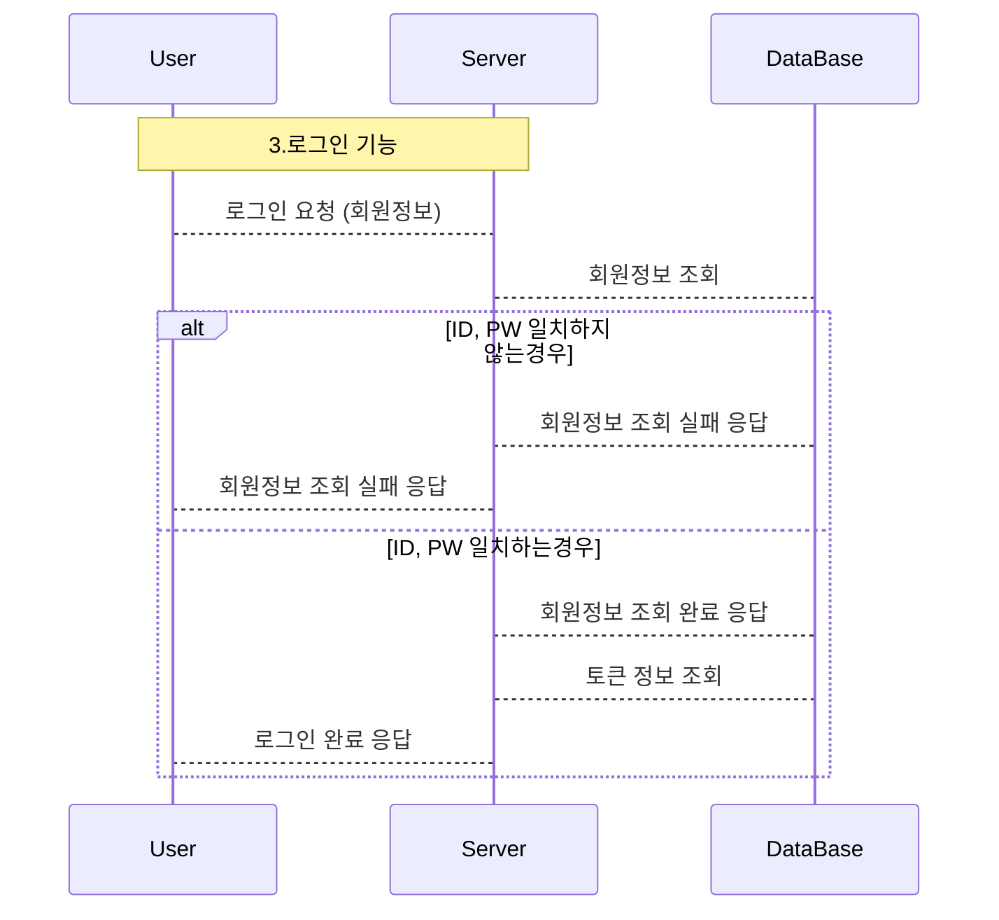
```mermaid
sequenceDiagram
    %% 3. 로그인 기능
    Note over User, Server: 3.로그인 기능
    User --> Server : 로그인 요청 (회원정보)
    Server --> DataBase : 회원정보 조회
    alt ID, PW 일치하지 않는경우
        DataBase --> Server : 회원정보 조회 실패 응답
        Server --> User : 회원정보 조회 실패 응답
    else ID, PW 일치하는경우
        DataBase --> Server : 회원정보 조회 완료 응답
        Server --> DataBase : 토큰 정보 조회
        Server --> User : 로그인 완료 응답
    end
```

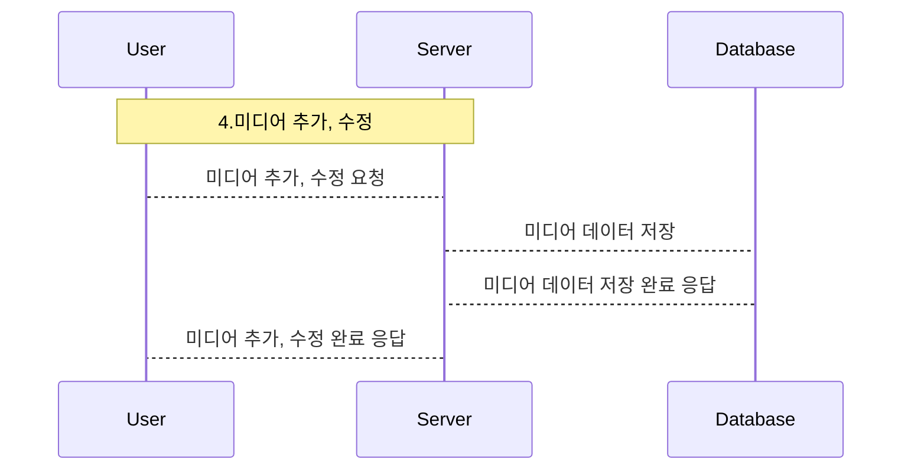
```mermaid
sequenceDiagram
    %% 4.사용자 media 기능
    Note over User, Server : 4.미디어 추가, 수정
    User --> Server : 미디어 추가, 수정 요청
    Server --> Database : 미디어 데이터 저장
    Database --> Server : 미디어 데이터 저장 완료 응답
    Server --> User : 미디어 추가, 수정 완료 응답
```

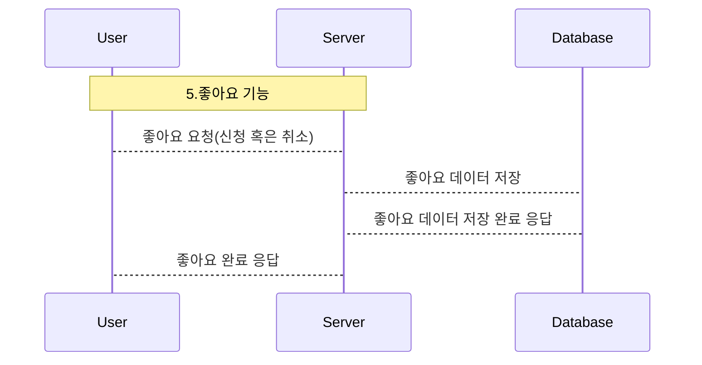
```mermaid
sequenceDiagram
    %% 5.좋아요 기능
    Note over User, Server : 5.좋아요 기능
    User --> Server : 좋아요 요청(신청 혹은 취소)
    Server --> Database : 좋아요 데이터 저장
    Database --> Server : 좋아요 데이터 저장 완료 응답
    Server --> User : 좋아요 완료 응답
```

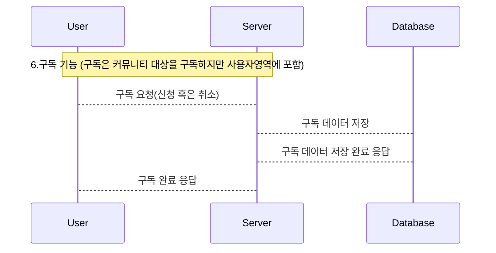
```mermaid
sequenceDiagram
    %% 6.구독 기능
    Note over User, Server : 6.구독 기능 (구독은 커뮤니티 대상을 구독하지만 사용자영역에 포함)
    User --> Server : 구독 요청(신청 혹은 취소)
    Server --> Database : 구독 데이터 저장
    Database --> Server : 구독 데이터 저장 완료 응답
    Server --> User : 구독 완료 응답
```

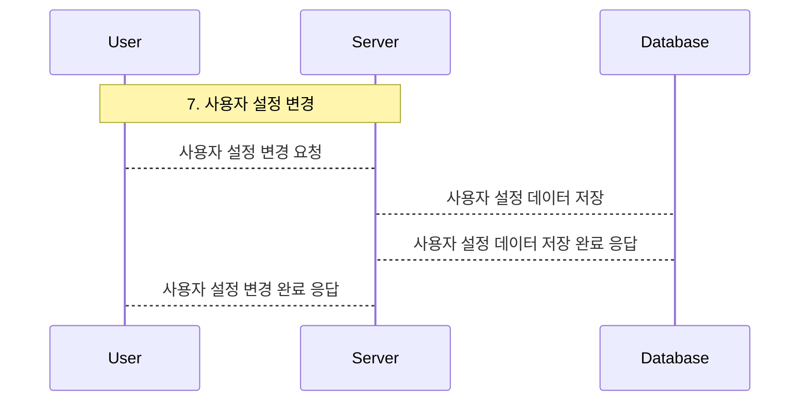
```mermaid
sequenceDiagram
    %% 7. 사용자 설정 저장, 추가
    Note over User, Server :7. 사용자 설정 변경
    User --> Server : 사용자 설정 변경 요청
    Server --> Database : 사용자 설정 데이터 저장
    Database --> Server : 사용자 설정 데이터 저장 완료 응답
    Server --> User : 사용자 설정 변경 완료 응답
```

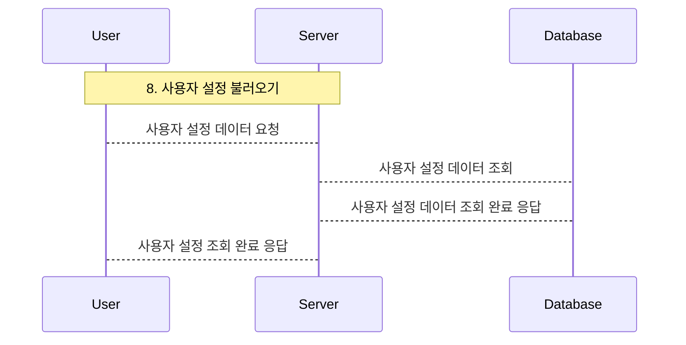
```mermaid
sequenceDiagram
    %% 8. 사용자 설정 불러오기
    Note over User, Server :8. 사용자 설정 불러오기
    User --> Server : 사용자 설정 데이터 요청
    Server --> Database : 사용자 설정 데이터 조회
    Database --> Server : 사용자 설정 데이터 조회 완료 응답
    Server --> User : 사용자 설정 조회 완료 응답
```

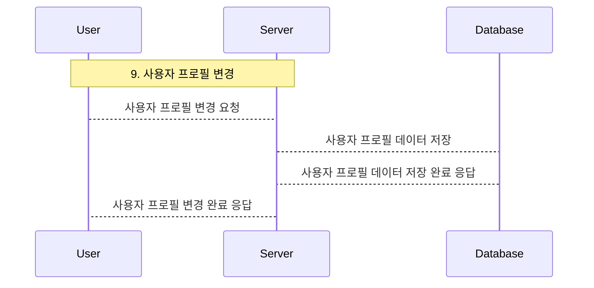
```mermaid
sequenceDiagram
    %% 9. 사용자 프로필 저장, 변경
    Note over User, Server :9. 사용자 프로필 변경
    User --> Server : 사용자 프로필 변경 요청
    Server --> Database : 사용자 프로필 데이터 저장
    Database --> Server : 사용자 프로필 데이터 저장 완료 응답
    Server --> User : 사용자 프로필 변경 완료 응답
```

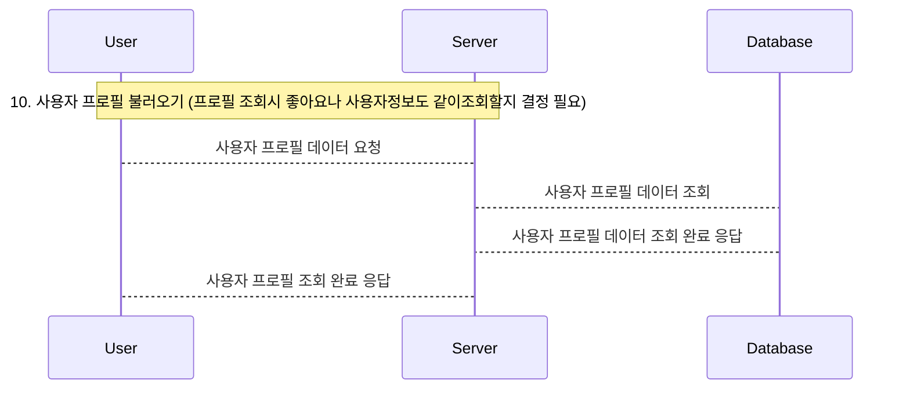
```mermaid
sequenceDiagram
    %% 10. 사용자 프로필 불러오기
    Note over User, Server :10. 사용자 프로필 불러오기 (프로필 조회시 좋아요나 사용자정보도 같이조회할지 결정 필요)
    User --> Server : 사용자 프로필 데이터 요청
    Server --> Database : 사용자 프로필 데이터 조회
    Database --> Server : 사용자 프로필 데이터 조회 완료 응답
    Server --> User : 사용자 프로필 조회 완료 응답
```

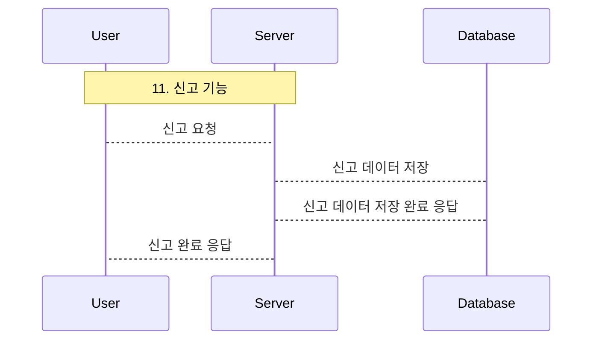
```mermaid
sequenceDiagram
    %% 11. 신고 기능
    Note over User, Server :11. 신고 기능
    User --> Server : 신고 요청
    Server --> Database : 신고 데이터 저장
    Database --> Server : 신고 데이터 저장 완료 응답
    Server --> User : 신고 완료 응답
```